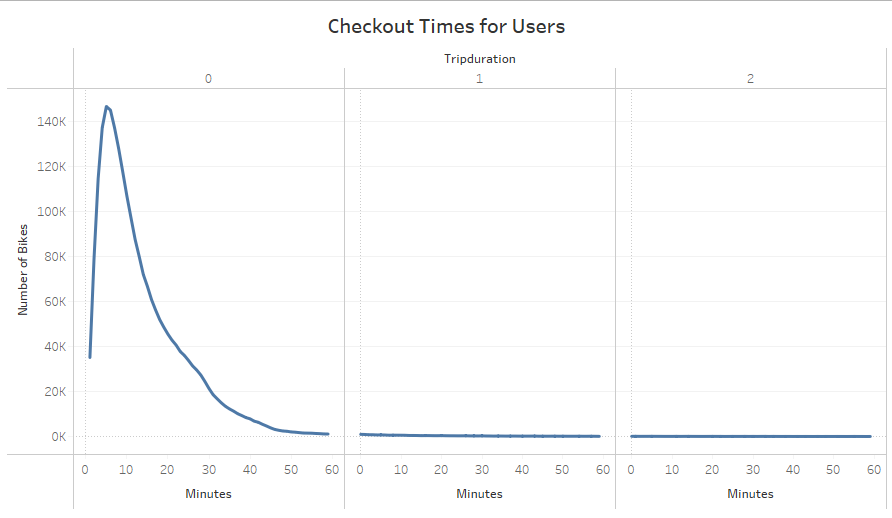

# Bikesharing
Creating visualizations with Tableau

## Table of Contents
- [Overview of Project](#OverviewProject)
  * [Background](#Background)
  * [Purpose](#purpose)
- [Results](#results)
  * [Information at first glance](#info)
  * [August Peak Hours](#peakhrs)
  * [Checkout Times for Users](#chktm_usr)
  * [Checkout Times by Gender](#chktm_gndr)
  * [Trips by Weekday for Each Hour](#trps_weekday)
  * [Trips by Gender (Weekday per Hour)](#trps_gndr)
  * [User Trips by Gender by Weekday](#usr_trp)
  * [Bike Utilization](#bk_utl)
  * [Bike Repairs](#bk_rpr)
  * [Top Starting Locations](#strt_loc)
  * [Top Ending Locations](#end_loc)
- [Analysis Summary](#Summary)
- [Resources](#resources)

## Overview of Project
### Background

Tableau is one of the most powerful data analysis and visualization software used in the professional world. It helps to transform the data into an engaging story for any audience.
It is popular because it allows data visualization professionals to create assets that are visually appealing and easy for a non technical audience to uderstand.  

With the help of Tableau we can :
- Create powerful analytical Dashboards
- Tell a clear story 
- Easily share the visualizations with others.

The key components of the tool are :
1. Worksheets
2. Dashboards
3. Stories 

### Purpose

In this project we are analyzing the bike-sharing business model in the **New York city** with the help of the visualization tool - **Tableau** to present a business proposal. The idea is to analyze the data and create various visualizations to understand and figure out how the bike sharing business actually works in NYC, and then expand that business idea to various other cities. From here we can prepare a proposal of how this business can work in other cities.

We will create worksheets, dashboards, and stories to visualize key data from a [New York Citi Bike dataset](#https://ride.citibikenyc.com/system-data).  We'll use data from the month of August because there is likely more traffic during the summer months.
 
## Results

***Tableau link to the NYC CitiBike story -> [Click Here](https://public.tableau.com/app/profile/shreha/viz/NYCCItibikeStory/Story2?publish=yes)***

### Information at first glance

Looking at the first chart in our story, we can conclude the following:
1. There are a total of **2,344,224** rides in the NewYork City. 
2. There are 2 types of UserTypes - Short term **Customers** and Long Term **Subscribers**.
3. We can clearly see that short term customers amount to less than 1/4th of the riders. Mojority of the riders are long term subscribers.
3. Majority of the riders are **males** as compared to females. The female riders are less than 1/4th of the total rider population.
4. In general, the later the birth year, the longer the average ride duration. 

  
  

 <i>Basic Info</i> 

### August Peak Hours

The chart below shows the peak hours of riding a bike in the month of August. The most popular hours when the maximum riders rent the bike is from 4 pm to 7 pm, with 5pm being the peak hour. The second most popular time is from 6pm to 7pm.

  
  

 <i>Basic Info</i> 

### Checkout Times for Users

The graph below shows the length of time that bikes are checked out for all riders. The number of bikes checkedout is on the y axis and the trip duration on the X axis. We can conclude that the bikes are checked out for a maximum of 15 to 20 minutes.

  
  

 <i>Checkout Times for Users</i> 

### Checkout Times by Gender

The graph below shows the number of bikes checkedout on the y axis and the trip duration on the X axis. Male, Felmale and Unknown gender curves are represented by 3 different colors - Green, Blue and Yellow. We can conclude frrom the graph that the checkout times for males is much higher than for female. 

  
  

 <i>Checkout times by Gender</i> 

### Trips by Weekday for Each Hour

The heat map below shows the ride times during each day of the week. We can conclude that the most busy morning times of the weekdays, ie from monday to friday are from 8 am to 9 am . And the most popular evening times during the weekdays are from 5 pm to 7 pm. These times are the busy hours as this is the time when most of the prople are biking to and from work.  
During the weekends, ie saturday and sunday, the most popular ride times range from 11 am to 5 pm.

  
  

 <i>Trips by Weekday for Each Hour</i> 

### Trips by Gender (Weekday per Hour)

The below heat map shows the ride times during each day of the week, broken down by gender. From this heat map we conclude the same result that the most popular times during the weekedays are from 8 - 9 am and 5 pm to 7 pm. This time seems to be the same for the males and females, just that the female riders are much less compared to the males.

  
  

 <i>Trips by Gender (Weekday per Hour)</i> 

### User Trips by Gender by Weekday

The heat map below shows the number of rides by weekday, by user types and by gender. Amongst all the days, Thursday and Friday seems to be the most popular days for riding a bike for both males and females. Looks like the riders are more active when the weekend is on the way. The next busiest days are Monday and Tuesday for both males and females.  The heat map is very light for the customer during any day of the week, as the ratio of customer to subscriers is very less.

  
  

 <i>User Trips by Gender by Weekday</i> 

### Bike Utilization

This graph shows the utilization of each Citi Bike in New York City and helps us understand which bikes have the highest utilization. These will allow us to view the total usage time per bike, as well as which bikes are used the most frequently, which will give us insight into which bikes may need repairs. The bubbles in this plot show the bike utilization levels. If a bike has a higher utilization level, it will be a larger bubble.

  
  

 <i>Bike Utilization</i> 

### Bike Repairs

The bikes used most frequently will be the ones that require the most maintenance. Hence the below graph helps us determine which bikes have the highest sum of "Number of Rides." The darker the color , the higher that bike has been utilized and probably would require the most maintenance.

  
  

 <i>Bike Repairs</i> 

### Top Starting Locations

In order to understand the locations with highest-traffic, we plot the below graph. This graph helps us understand the top locations for starting a bike journey among Citi Bike customers. Larger bubbles represent locations with the highest number of trips, and smaller bubbles represent lowest number of trips. We also conclude that the downtown area is much more popular than surrounding areas.

  
  

 <i>Top Starting Locations</i> 

### Top Ending Locations

The below graph helps us determine the most popular locations to end a bike ride. The size of the symbols now corresponds to the popularity of a given location. the darker the color, the more popular the location is. It seems that Downtown area is the most popular area for ending a bike ride too. 

  
  

 <i>Top Ending Locations</i> 

## Analysis Summary

I make the following conclusions after analyzing more than 2.3 million bike-ride records for the city of New York in the month of August, 2019 :

1. There are 2 types of users in the city - Customers and Subscribers. The majority of the users are annual subscribers as compared to non-subscribers which might include riders like tourists.
2. Males are more active riders compared to females. Females account to less than one fourth of the total riders.
3. The most popular days amongst all the riders are weekdays as compared to weekends. Thursday and Friday seem to be the most popular days, with most popular time ranging from 8 to 9 am and 5 to 7 pm. This indicates that most riders are commuting to and from work.
4. Males are more active over the weekends (Saturday and Sunday) compared to females. 
5. Downtown area is the most popular area for and starting and ending a bike-ride trip.

The bike-ride analysis for the city of New York helps us understand - the business, the target audience, the most popular times during the weekdays and weenends, the places where to set up the bike stations, bike-repairs and much more. It would be a great idea to evaluate data for several other cities spanning diferent geographic locations. That would help us create a more robust business proposal.

##  Resources
[1] [Citi Bike Data Source](https://ride.citibikenyc.com/system-data)  

[2] Language:
* Python  

[3] Software: 
* Tableau Public 2022.1  
* Visual Studio Code 1.64.2
 
